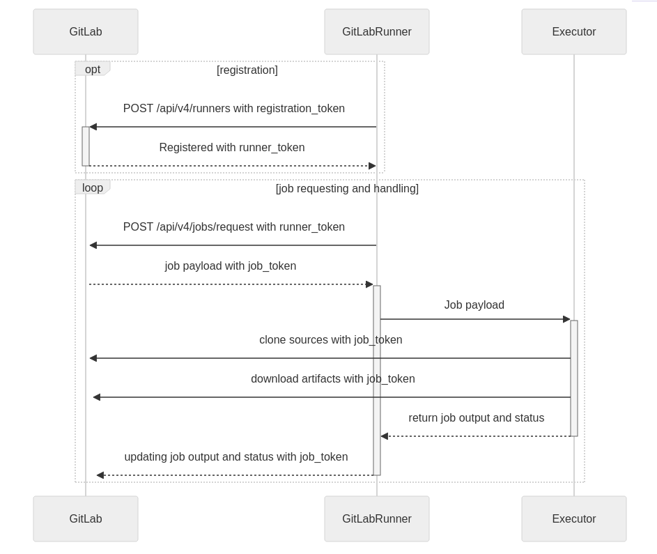
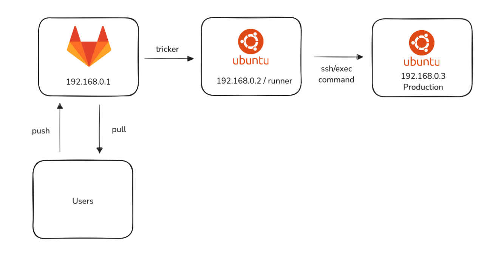
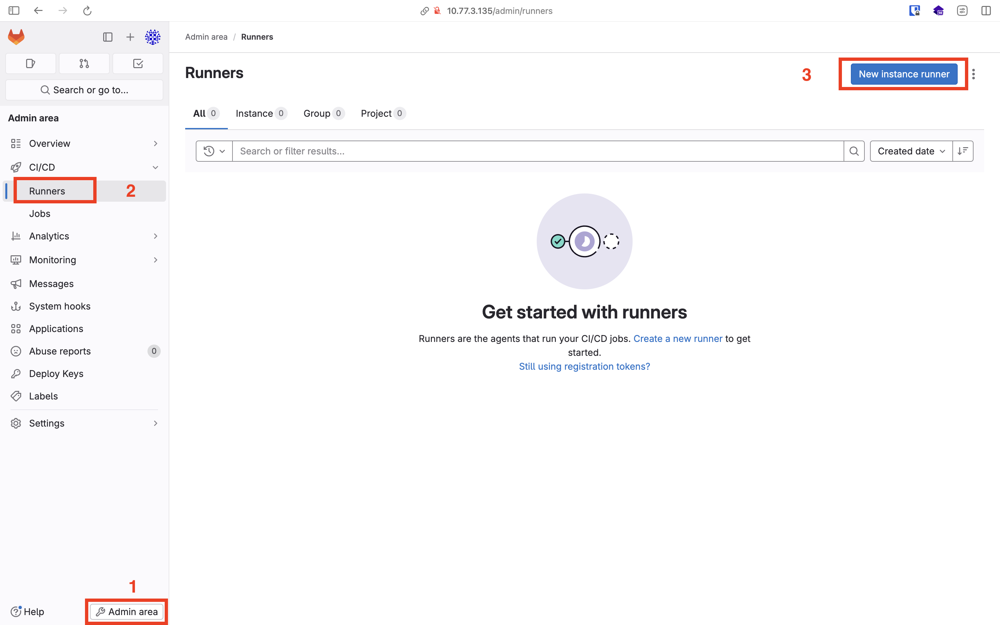
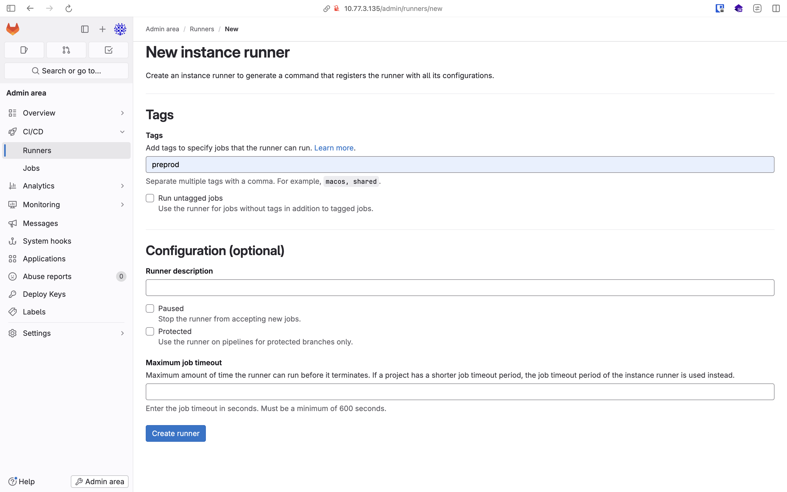

### CICD with Gitlab

#### Gitlab Diagram

<figure>

</figure>

#### Gitlab Diagram 2

<figure>

</figure>

Install GitLab Runner

```bash
curl -LJO "https://s3.dualstack.us-east-1.amazonaws.com/gitlab-runner-downloads/latest/deb/gitlab-runner_amd64.deb"

sudo dpkg -i gitlab-runner_amd64.deb

sudo chmod +x /usr/bin/gitlab-runner
```

Create Install

<figure>

</figure>

<figure>

</figure>

Register Runner

```bash
gitlab-runner register  --url $IP  --token $TOKEN
```

CICD Testing

```yaml
<name-of-job>:
    stage: <name-of-stage>
    tags:
        - <name-of-tags>
    script:
        - <custom script>
    only:
        - <branch>
```
