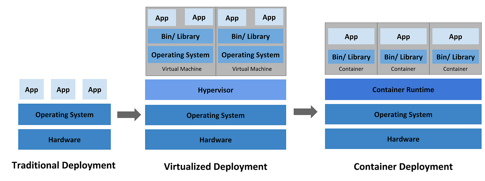
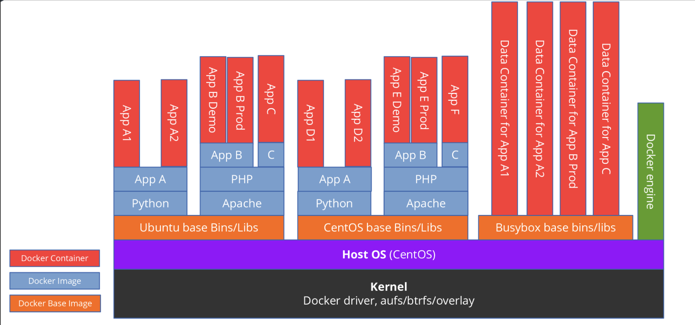

### Docker

#### What's Docker?
<figure>

</figure>

#### Docker Concept
<figure>

</figure>


#### Command
List all running containers 
```bash
docker ps -a
```

Stop the container which is running
```bash
docker stop <container-id>
```

Start the container which is stopped
```bash
docker start <container-id>
```

Restart the container which is running
```bash
docker restart <container-id>
```

List port mappings of a specific container
```bash
docker port <container-id>
```

Remove the stopped container
```bash
docker rm container-id 
```

#### Docker Compose
```yaml
services:
  <namespace>:
    image: <image>
    volumes:
      - <host_path>:<docker_path>
    restart: <rule>
    environment:
      <name>: <value>
    ports:
      - <host_port>:<docker_port>
```

#### Example
```yaml
services:
  db:
    platform: linux/x86_64
    image: mysql
    volumes:
      - ./db_data:/var/lib/mysql
    restart: always
    environment:
      MYSQL_ROOT_PASSWORD: password
      MYSQL_DATABASE: yourdb
      MYSQL_PASSWORD: password

  phpmyadmin:
    depends_on:
      - db
    image: phpmyadmin
    restart: always
    ports:
      - "8090:80"
    environment:
      PMA_HOST: db
      MYSQL_ROOT_PASSWORD: password
```