### วิธีการติดตั้ง Gitlab CE

Update & Upgrade Packages

```sh
sudo apt update && sudo apt upgrade -y
```

<figure>
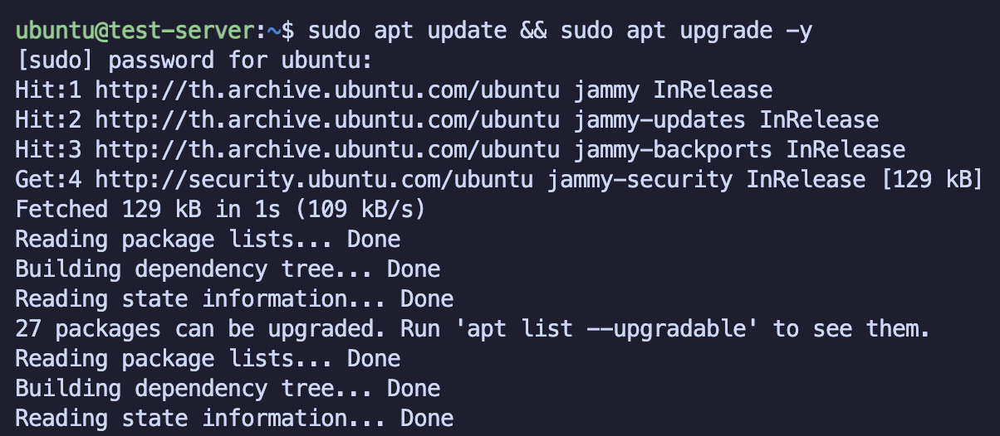
</figure>

ตั้งค่า Time Zone

```sh
sudo timedatectl set-timezone Asia/Bangkok
```

ติดตั้ง Packages ที่จำเป็นต้องใช้

```sh
sudo apt install build-essential curl openssh-server tzdata debian-archive-keyring lsb-release ca-certificates apt-transport-https software-properties-common
```

<figure>
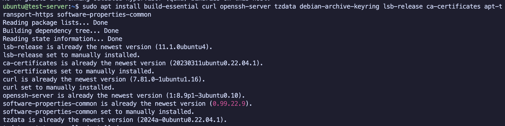
</figure>

ติดตั้ง Gitlab Version CE

```sh
curl -sS https://packages.gitlab.com/install/repositories/gitlab/gitlab-ce/script.deb.sh | sudo bash
```

<figure>
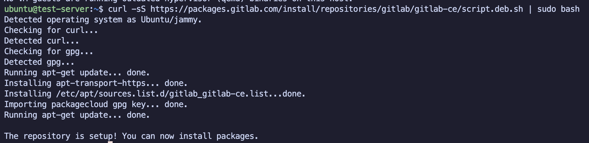
</figure>

```sh
sudo apt install gitlab-ce
```

<figure>
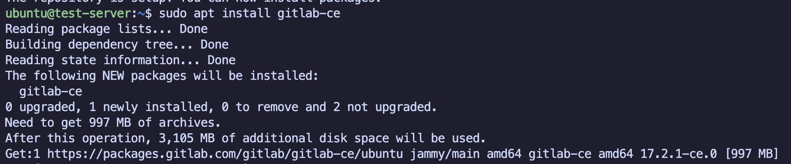
</figure>

แก้ไขการตั้งค่า Base URL

```sh
sudo nano /etc/gitlab/gitlab.rb
```

<figure>
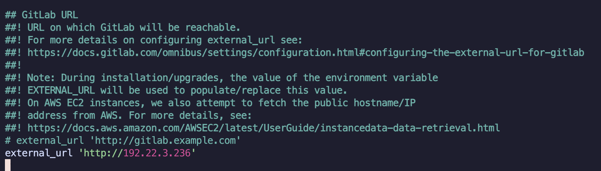
</figure>

เมื่อแก้ไข configure จำเป็นต้องทำการ reconfigure ใหม่ทุกครั้ง

```sh
sudo gitlab-ctl reconfigure
```

<figure>
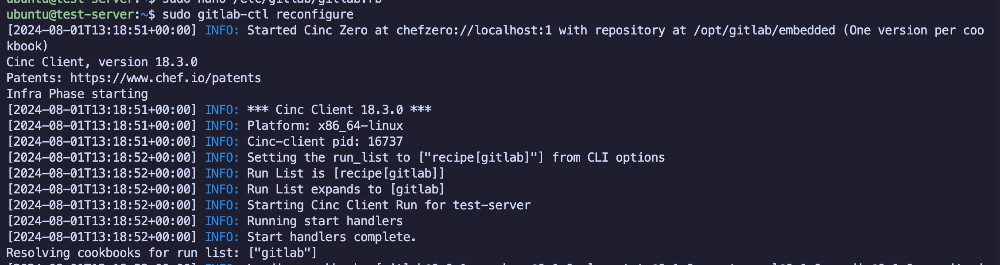
</figure>

เมื่อมีการติดตั้ง gitlab server ใหม่ ระบบจะมีการสร้าง root password ให้โดยจะอยู่ในไฟล์ `/etc/gitlab/initial_root_password`

```sh
sudo cat /etc/gitlab/initial_root_password

Password: xxxxx

# NOTE: This file will be automatically deleted in the first reconfigure run after 24 hours.
```

เข้าสู่หน้า Gitlab ด้วย `http://server-ip` โดย username ใช้เป็น `root` ส่วน password ใช้เป็น initial root password จากไฟล์

<figure>
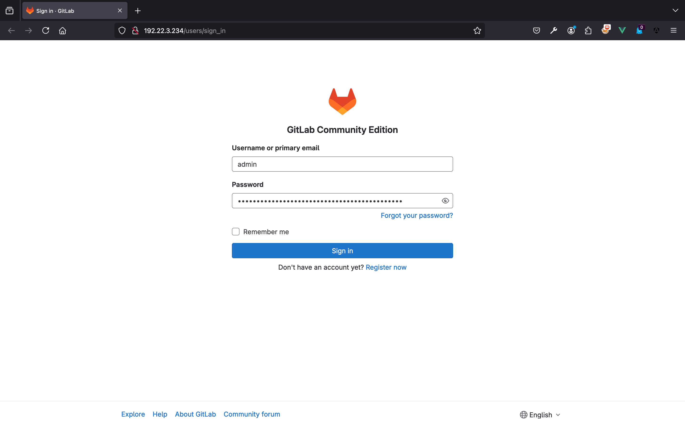
</figure>

ปิดการใช้งานเมนู Sign-up ซึ่งจะเป็นการทำให้ ไม่สามารถสร้าง User ด้วยตัวเองได้ โดยจำเป็นต้องให้ Admin สร้างให้เท่านั้น (เพื่อป้องกันผู้อื่นเข้ามาใช้งาน) โดยเมนูนี้จะสามารถแก้ไขด้วย User Root เท่านั้น

Admin Area -\> Settings -\> General -\> Sign-up restrictions -\> Sign-up enabled (ติ๊กอันนี้ออก)

<figure>
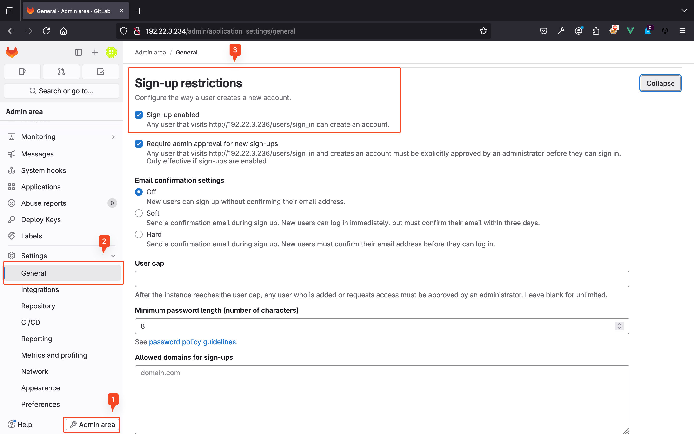
</figure>

หากถูกต้องปุ่ม Signup ในหน้าหลักจะหายไป

<figure>
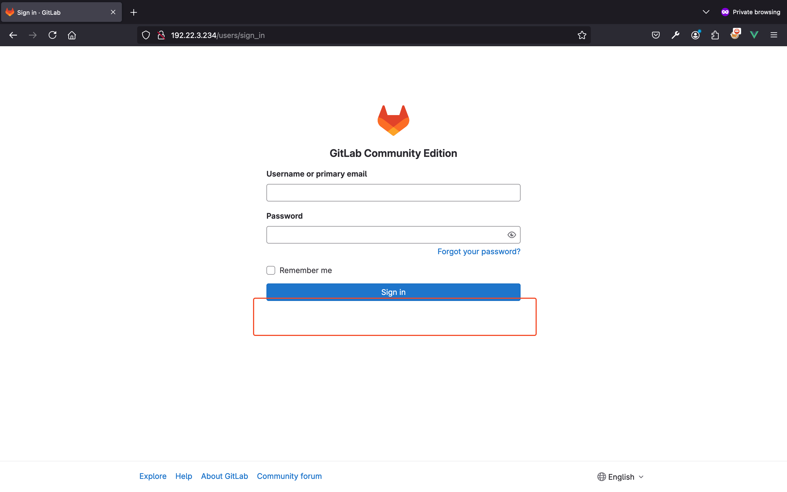
</figure>

จากนั้นทำการเปลี่ยนแปลงรหัสผ่านของ Admin โดยรหัสผ่านควรมีความยาว 12 ตัวอักษรขึ้นไปและคาดเดาได้ยาก

<figure>
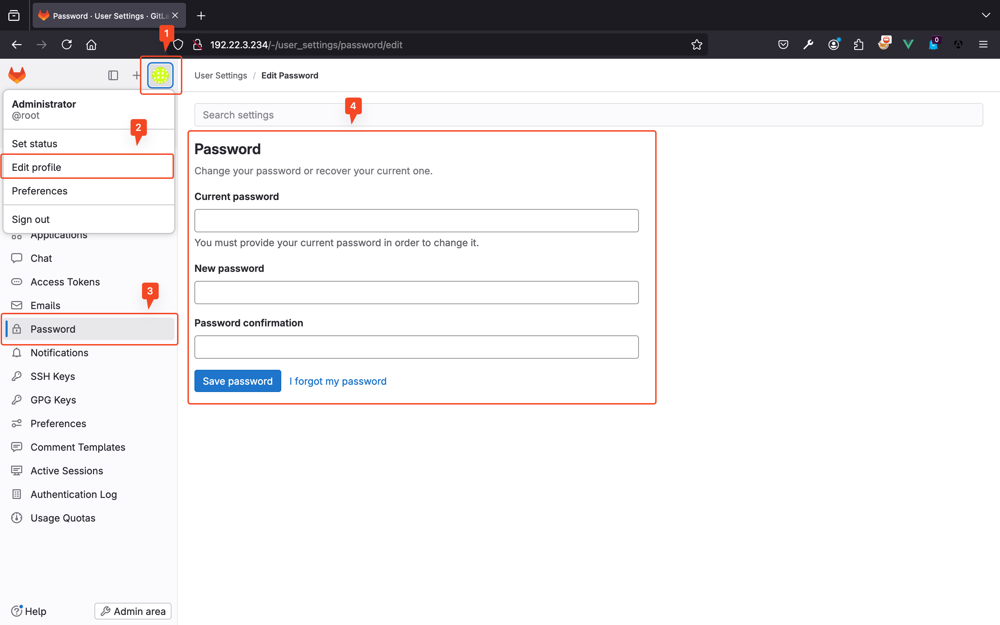
</figure>

การตั้งค่า Firewall: ปกติแล้ว gitlab server จะใช้งานเพียง 2 Port คือ 22 (ssh) และ 80 (http)

```sh
sudo apt install ufw

sudo ufw allow openssh
sudo ufw allow http

# หรือ
sudo ufw allow from 192.168.88.0/24 to any port 22
sudo ufw allow from 192.168.88.0/24 to any port 80

sudo ufw enable
# answer: y

sudo ufw status
# Status: active
#
# To                         Action      From
# --                         ------      ----
# OpenSSH                    ALLOW       Anywhere
# 80/tcp                     ALLOW       Anywhere
# OpenSSH (v6)               ALLOW       Anywhere (v6)
# 80/tcp (v6)                ALLOW       Anywhere (v6)

# Command อื่น ๆ
sudo ufw status numbered
Status: active

     To                         Action      From
     --                         ------      ----
[ 1] OpenSSH                    ALLOW IN    Anywhere
[ 2] 80/tcp                     ALLOW IN    Anywhere
[ 3] 23                         ALLOW IN    192.168.88.0/24
[ 4] OpenSSH (v6)               ALLOW IN    Anywhere (v6)
[ 5] 80/tcp (v6)                ALLOW IN    Anywhere (v6)

sudo ufw delete 3
```

ทดสอบด้วย nmap

```sh
nmap -p- 192.22.3.150

# Nmap scan report for 192.22.3.150
# Host is up (0.018s latency).
# Not shown: 998 filtered tcp ports (no-response)
# PORT   STATE SERVICE
# 22/tcp open  ssh
# 80/tcp open  http
```

ผู้ที่เป็น Admin สามารถสร้าง User ให้ได้

Admin Area -\> Overview -\> Users -\> New User

-   Name, Username, Email: ตั้งอะไรก็ได้
-   Access level: ถ้าเป็น ผนง. ทั่วไปตั้งเป็น Regular, ถ้าต้องการให้เป็น Admin เลือกเป็น Administrator
    

#### SSH keypair authentication

ไปยัง Drive C -\> Users -\> เลือก Users ที่มีการใช้งานอยู่ จากนั้นทำการแก้ไขการตั้งค่า View -\> Show -\> ติ๊ก Hidden Items และ File name extensions

<figure>
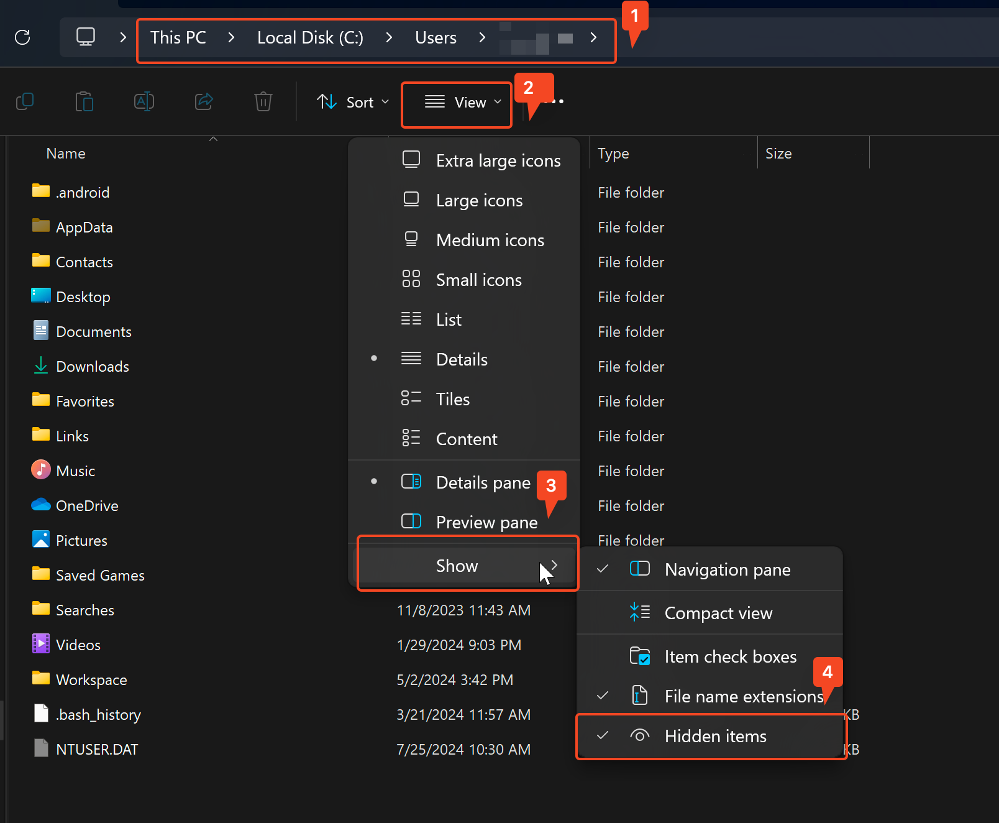
</figure>

สร้าง Folder .ssh และเข้าไปยัง Folder ดังกล่าว จากนั้นสร้างไฟล์ชื่อ config (แบบไม่มีนามสกุล)

<figure>
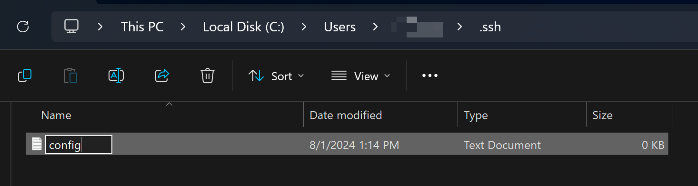
</figure>

เปิด cmd `ssh-keygen -t rsa` จากนั้นสร้างไฟล์ให้เรียบร้อย

<figure>
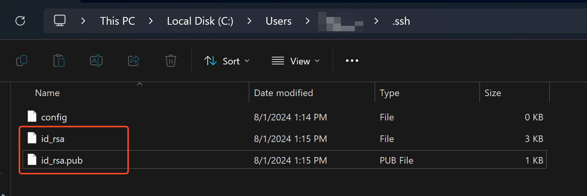
</figure>

เพิ่ม ภายในไฟล์ \~/.ssh/config
โดย Host คือหมายเลข IP ของ Gitlab Server และ IdentityFile คือไฟล์ที่สร้างขึ้นมาจากขั้นตอนก่อนหน้า

```sh
Host 192.22.3.150
IdentityFile ~/.ssh/id_rsa
```

จากนั้นเปิดไฟล์ id_rsa.pub ด้วย notepad และ copy content ข้างในไว้

กลับไปที่ Gitlab, กดปุ่ม Profile -\> Edit Profile -\> SSH Keys และเพิ่ม SSH Key นำ content ในไฟล์ id_rsa.pub ไปไว้ใน SSH KEYS

ปล. เอา expired date ออกด้วย


ทดสอบ connect `ssh -T git@gitlab-ip`

