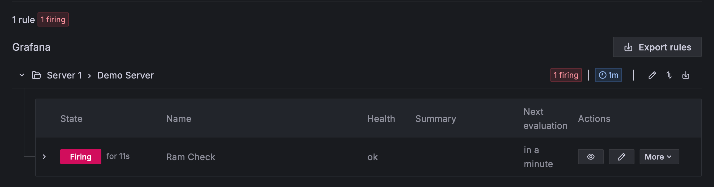

<figure>

</figure>

Update และติดตั้ง Package ที่สำคัญ

```bash
sudo apt update
sudo apt upgrade -y
sudo apt-get install -y apt-transport-https software-properties-common wget
```

<figure>

</figure>

Import the GPG key

```bash
sudo mkdir -p /etc/apt/keyrings/

wget -q -O - https://apt.grafana.com/gpg.key | gpg --dearmor | sudo tee /etc/apt/keyrings/grafana.gpg > /dev/null

echo "deb [signed-by=/etc/apt/keyrings/grafana.gpg] https://apt.grafana.com stable main" | sudo tee -a /etc/apt/sources.list.d/grafana.list

sudo apt update
```

<figure>

</figure>

ติดตั้ง Grafana

```bash
sudo apt-get install grafana
```

<figure>

</figure>

หากต้องการแก้ไขการตั้งค่าต่าง ๆ ของ grafana สามารถแก้ไขได้ที่ `/etc/grafana/grafana.ini`

```sh
sudo nano /etc/grafana/grafana.ini

# The http port  to use
;http_port = 3000
```

ทำการเปิดการใช้งาน grafana-server

```bash
sudo systemctl daemon-reload
sudo systemctl start grafana-server
sudo systemctl status grafana-server
sudo systemctl enable grafana-server.service
```

เข้าใช้งาน

    http://server_ip:3000

    default credential -> admin:admin

<figure>

</figure>

เมื่อเข้าใช้งานครั้งแรก ระบบจะบังคับให้เปลี่ยนรหัสผ่านใหม่

<figure>

</figure>

<figure>

</figure>


ที่มา https://blog.devops.dev

ติดตั้ง prometheus

สร้าง User prometheus ซึ่งเป็นเพียง Service User ไม่สามารถ Login ได้

```sh
sudo useradd -M -r -s /bin/false prometheus
```

สร้าง Directory ที่จำเป็น

```sh
sudo mkdir /etc/prometheus /var/lib/prometheus
```

ดาวโหลด Prometheus จาก Github

```sh
cd /tmp
wget https://github.com/prometheus/prometheus/releases/download/v2.45.6/prometheus-2.45.6.linux-amd64.tar.gz
tar xzf prometheus-2.45.6.linux-amd64.tar.gz
```

Copy ไฟล์และแก้ไขสิทธิ์ต่าง ๆ

```sh
sudo cp prometheus-2.45.6.linux-amd64/{prometheus,promtool} /usr/local/bin/

sudo chown prometheus:prometheus /usr/local/bin/{prometheus,promtool}

sudo cp -r prometheus-2.45.6.linux-amd64/{consoles,console_libraries} /etc/prometheus/

sudo cp prometheus-2.45.6.linux-amd64/prometheus.yml /etc/prometheus/

sudo chown -R prometheus:prometheus /etc/prometheus

sudo chown prometheus:prometheus /var/lib/prometheus
```

แก้ไข Configure

```sh
sudo nano /etc/prometheus/prometheus.yml
```

```sh
scrape_configs:
...
### เพิ่มตรงนี้
  - job_name: "node"
    static_configs:
      - targets: ["localhost:9100"]
```

<figure>

</figure>

สร้างไฟล์ Service

```sh
sudo nano /etc/systemd/system/prometheus.service
```

```sh
[Unit]
Description=Prometheus Time Series Collection and Processing Server
Wants=network-online.target
After=network-online.target

[Service]
User=prometheus
Group=prometheus
Type=simple
ExecStart=/usr/local/bin/prometheus \
    --config.file /etc/prometheus/prometheus.yml \
    --storage.tsdb.path /var/lib/prometheus/ \
    --web.listen-address 0.0.0.0:9090 \
    --web.console.templates=/etc/prometheus/consoles \
    --web.console.libraries=/etc/prometheus/console_libraries

[Install]
WantedBy=multi-user.target
```

Start Service

```sh
sudo systemctl daemon-reload
sudo systemctl enable --now prometheus
sudo systemctl status prometheus
```

ติดตั้ง node_exporter

```sh
sudo useradd -M -r -s /bin/false node_exporter

cd /tmp
wget https://github.com/prometheus/node_exporter/releases/download/v1.8.1/node_exporter-1.8.1.linux-amd64.tar.gz

tar xvf node_exporter-1.8.1.linux-amd64.tar.gz

sudo mv node_exporter-1.8.1.linux-amd64 /opt/node_exporter
sudo chown -R node_exporter:node_exporter /opt/node_exporter

sudo nano /etc/systemd/system/node_exporter.service
```

```sh
[Unit]
Description=Node Exporter
Wants=network-online.target
After=network-online.target

[Service]
User=node_exporter
Group=node_exporter
Type=simple
ExecStart=/opt/node_exporter/node_exporter --collector.systemd

[Install]
WantedBy=multi-user.target
```

```sh
sudo systemctl daemon-reload
sudo systemctl start node_exporter
sudo systemctl enable node_exporter
sudo systemctl restart prometheus
```

<figure>

</figure>

Connect Prometheus to grafana

ไปที่เมนู Connections -\> Add new connection -\> Data source

<figure>

</figure>

<figure>

</figure>

โดยในส่วนของ Prometheus server url ให้ใส่เป็น IP ของ server ที่ติดตั้ง Prometheus ไว้ ตามด้วย port 9090

<figure>

</figure>

หากกด Save & Test แล้วได้ message แบบด้านล่าง แสดงว่าใช้งานได้

<figure>

</figure>

จากนั้นทำการสร้าง Dashboard เพิ่ม ไปยัง Home -\> Dashboard และกดปุ่ม New

<figure>

</figure>

<figure>

</figure>

Grafana Linux Dashboard: **1860**

<figure>

</figure>

<figure>

</figure>

<figure>

</figure>

หากต้องการเพิ่มการแจ้งเตือน

สร้าง Contact Point สำหรับส่งการแจ้งเตือน

<figure>

</figure>

ตัวอย่างจะเป็นการสร้าง Line Notify โดยให้เลือก Integration เป็น LINE และนำ Token มาใส่

<figure>

</figure>

<figure>

</figure>

<figure>

</figure>

ทำการสร้าง New Alert Rule

<figure>

</figure>

กลับไปยัง Dashboard และทำการ Copy Query ที่ต้องการจะสร้างการแจ้งเตือน

<figure>

</figure>

<figure>

</figure>

กลับมายังในส่วนของ Define query and alert condition จากนั้นปรับเป็น Mode Code และนำ Query มาวาง
โดยสามารถทดสอบรันได้โดยกดปุ่ม Run queries และดูผลลัพธ์ด้านล่าง

<figure>

</figure>

จากนั้นทำการปรับ Condition ที่ตามที่ต้องการ


หลังแก้ไข

<figure>

</figure>

จากนั้นตั้งค่า Folder โดยหากยังไม่มีการสร้างไว้และสามารถสร้างใหม่ได้เลย

<figure>

</figure>

<figure>

</figure>

จากนั้นทำการเลือก Contact Point ที่ต้องการให้มีการแจ้งเตือน

<figure>

</figure>

และกดบันทึก

<figure>

</figure>

<figure>

</figure>

จากนั้นทดสอบทำให้ใช้ Disk มากยิ่งขึ้นเพื่อให้ถึง Condition

<figure>

</figure>

<figure>

</figure>

หมายเหต: จริง ๆ เป็นการ Storage Check แต่ในรูปพิมพ์ผิดเป็น Ram Check

<figure>

</figure>

ตั้งค่าเพิ่มเติมเกี่ยวกับ Firewall

```sh
sudo ufw allow from <IP_ADDRESS> to any port 9090
sudo ufw allow from <IP_ADDRESS> to any port 3000
```
