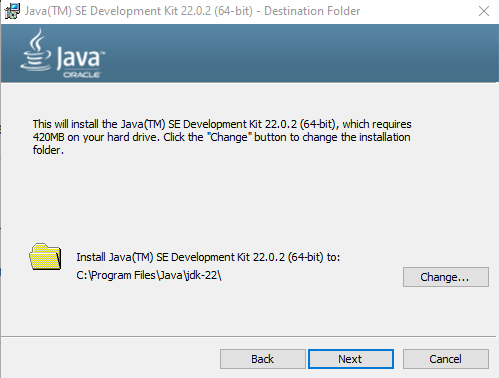
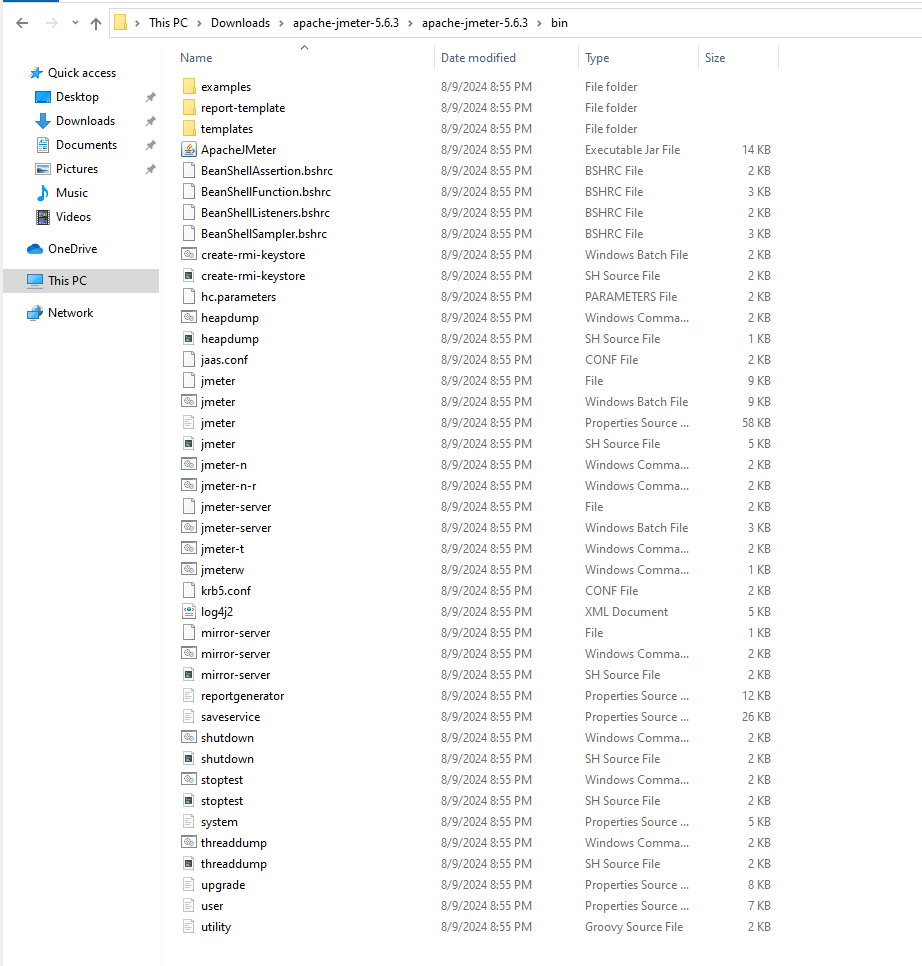
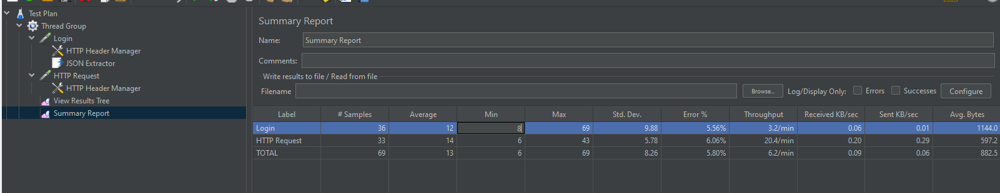

### การติดตั้งและใช้งาน JMeter Part 1

#### ติดตั้ง Java 8 (ขั้นต่ำ แต่ติดตั้งตัวใหม่กว่านี้ได้)

https://www.oracle.com/java/technologies/downloads/#jdk21-windows

<figure>

</figure>

ทดสอบโดยการพิมพ์ `java --version` (ต้อง restart cmd หลังจากที่มีการติดตั้ง java ก่อน)

<figure>

</figure>

#### ขั้นตอนการติดตั้ง Jmeter

https://jmeter.apache.org/ จากนั้นดาวโหลด apache-jemter-5.6.3.zip

<figure>

</figure>

แตก zip file และไปยัง folder: bin และทำการกดที่ไฟล์ `jmeter.bat`

<figure>

</figure>

<figure>

</figure>

<figure>

</figure>

<figure>

</figure>

<figure>

</figure>

<figure>

</figure>

<figure>

</figure>

<figure>

</figure>

<figure>

</figure>

<figure>

</figure>

<figure>

</figure>

<figure>

</figure>

<figure>

</figure>

<figure>

</figure>

<figure>

</figure>

<figure>

</figure>

<figure>

</figure>

<figure>

</figure>

<figure>

</figure>

Average = Response time เฉลี่ย(ms)
Error = มี Error กี่ % จากทั้งหมด
Throughput = TPS (Transaction per second) เป็นความสามารถในการจัดการงาน

Throughput = Request / time
