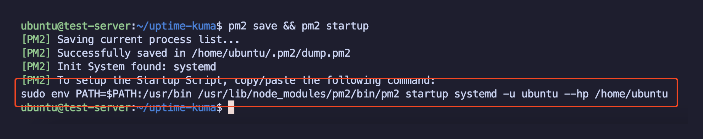
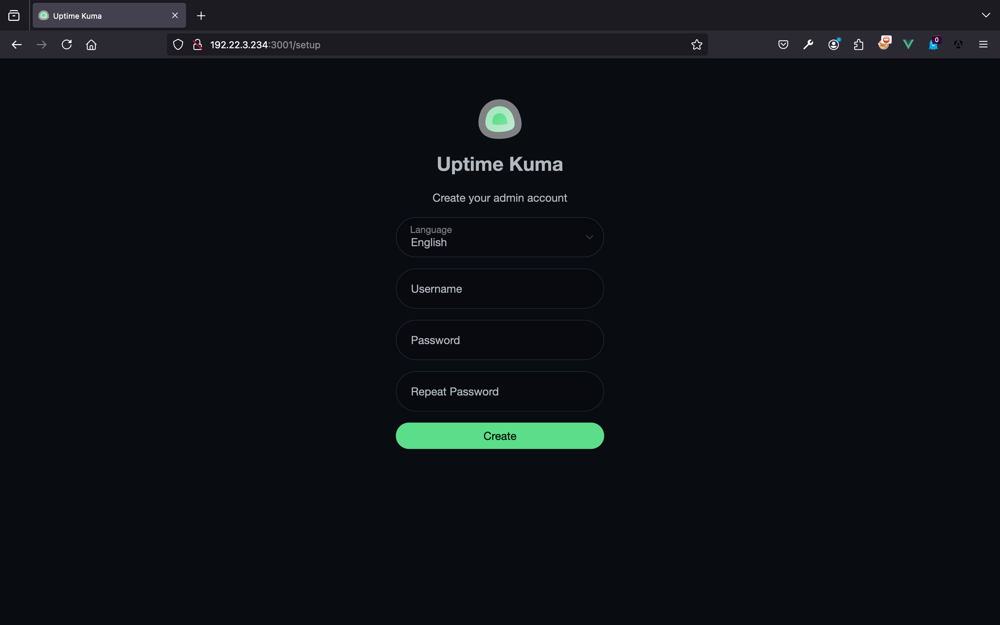
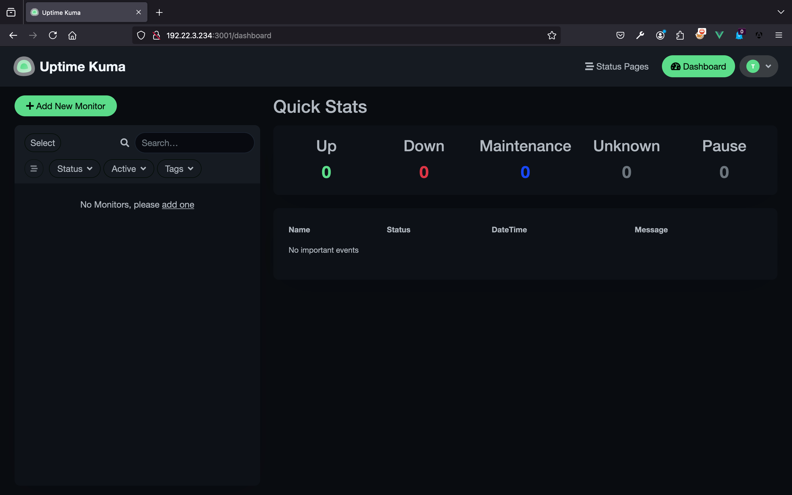
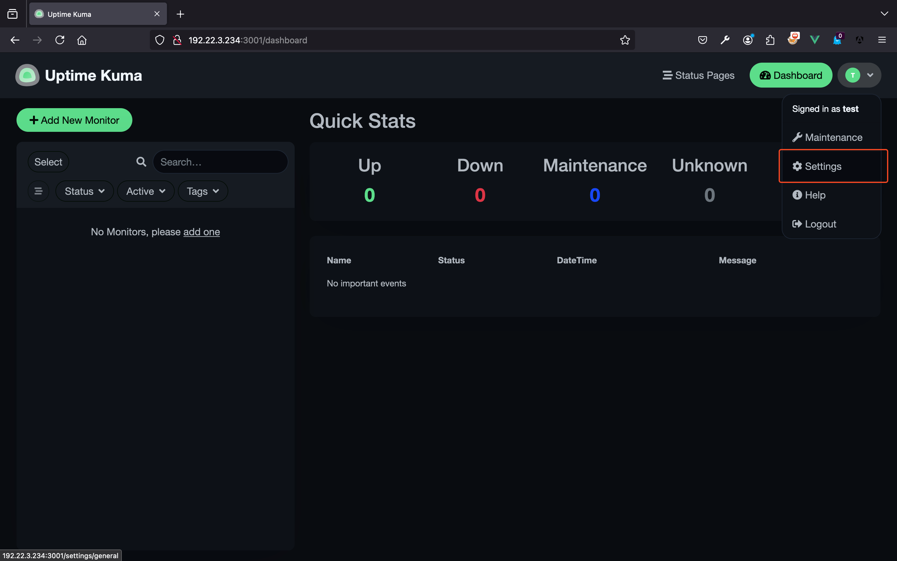
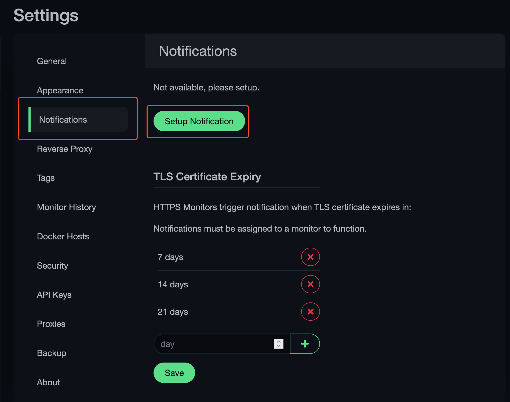
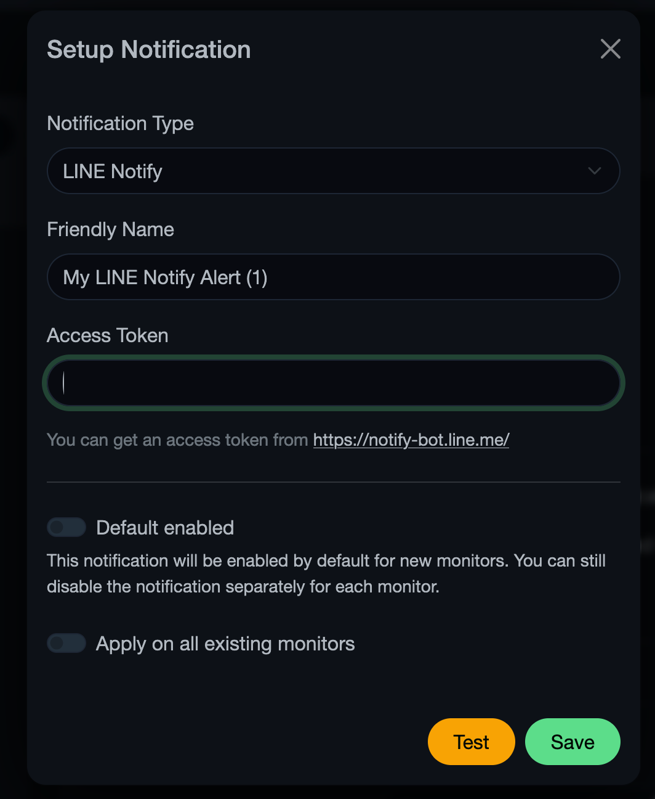
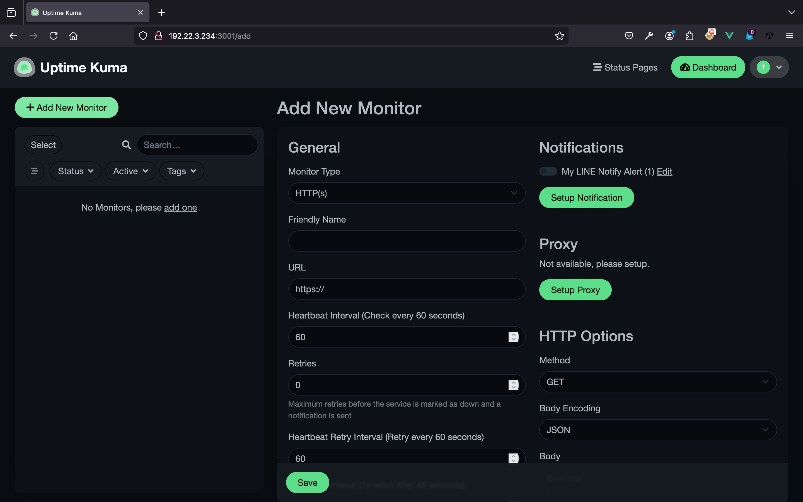
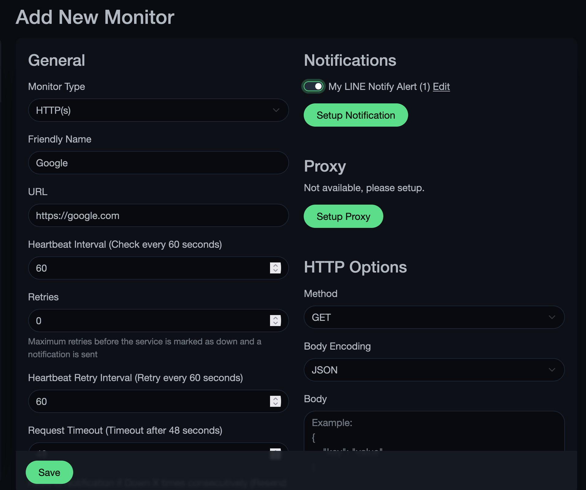
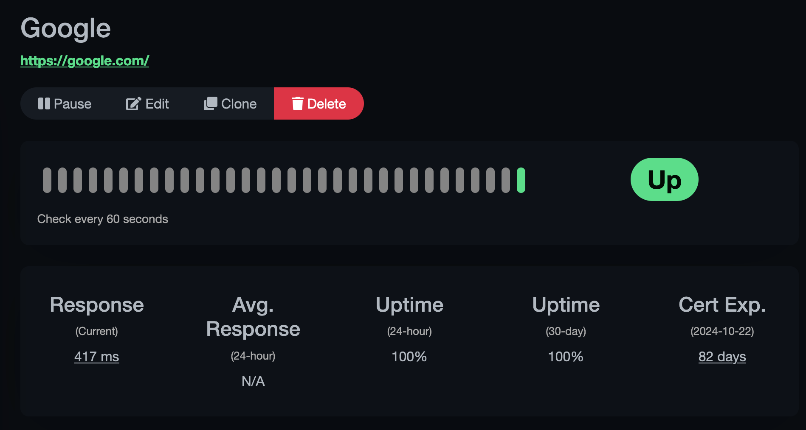

ติดตั้ง NodeJs

``` sh
curl -sL https://deb.nodesource.com/setup_20.x -o /tmp/nodesource_setup.sh

sudo bash /tmp/nodesource_setup.sh

sudo apt install nodejs
```

ติดตั้ง PM2

``` sh
sudo npm install -g pm2
```

Download repo ของ Uptime Kuma จาก Github

``` sh
git clone https://github.com/louislam/uptime-kuma.git

cd uptime-kuma
```

ติดตั้งและ Start

``` sh
npm run setup

pm2 install pm2-logrotate

pm2 start server/server.js --name uptime-kuma
```

บันทึกการตั้งค่าของ PM2 และสั่งให้ auto start

``` sh
pm2 save && pm2 startup
```

<figure>

<figcaption
aria-hidden="true">Pastedimage20240801215608.png</figcaption>
</figure>

`sudo env PATH=$PATH:/usr/bin /usr/lib/node_modules/pm2/bin/pm2 startup systemd -u ubuntu --hp /home/ubuntu`

เข้าใช้งาน

<figure>

<figcaption
aria-hidden="true">Pastedimage20240801215647.png</figcaption>
</figure>

<figure>

<figcaption
aria-hidden="true">Pastedimage20240801215800.png</figcaption>
</figure>

จากนั้นทำการสร้างช่องทางสำหรับแจ้งเตือน โดยกดปุ่ม Profile -\> Settings

<figure>

<figcaption
aria-hidden="true">Pastedimage20240801215854.png</figcaption>
</figure>

<figure>

<figcaption
aria-hidden="true">Pastedimage20240801215924.png</figcaption>
</figure>

เลือกช่องทางการแจ้งเตือนที่ต้องการ

<figure>

<figcaption
aria-hidden="true">Pastedimage20240801220011.png</figcaption>
</figure>

จากนั้นกดปุ่ม Add New Monitor

<figure>

<figcaption
aria-hidden="true">Pastedimage20240801220047.png</figcaption>
</figure>

ตัวอย่างเช่น Monitor เว็บ Google

<figure>

<figcaption
aria-hidden="true">Pastedimage20240801220107.png</figcaption>
</figure>

<figure>

<figcaption
aria-hidden="true">Pastedimage20240801220134.png</figcaption>
</figure>
